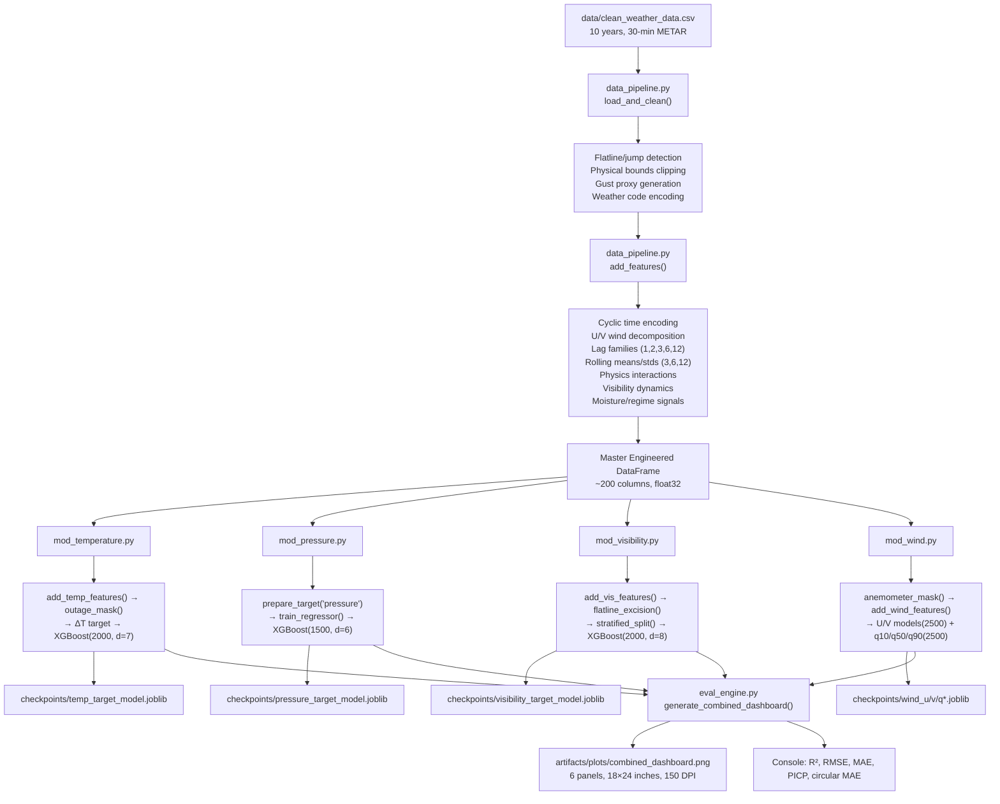

# CSMI Airport Operational Weather Forecasting System

An XGBoost/CUDA micro-modular forecasting pipeline for CSMI Airport (VABB), Mumbai — six-hour horizon at 30-minute cadence from METAR sensor data. Built for the MWO Mumbai (IMD) and Thakur College of Engineering and Technology collaborative research proposal.

> ⚠️ **Note on metric sourcing**: Metrics in this README are taken from the most recent local pipeline run on **July 24, 2026**, which regenerated `artifacts/plots/combined_dashboard.png` and logged the values programmatically. The wind MOS (`mod_wind_v2.py`) results are evaluated only on the overlapping period where Open-Meteo historical forecast data is available for VABB in practice: **2017-01-01 through 2025-12-31**.

---

## R² Gate Status

Operational gate threshold is **R² ≥ 0.90** for continuous targets. Wind direction uses circular MAE (degrees) since R² is geometrically invalid for angles.

| Parameter | R² / Circular MAE | Gate (≥0.90) | Status |
|---|---|---|---|
| Temperature | 0.9542 | ✅ | PASS |
| Pressure | 0.9628 | ✅ | PASS |
| Visibility | 0.9279 | ✅ | PASS |
| Wind Speed (baseline `mod_wind.py`) | 0.7286 | ⚠️ | FAIL |
| Wind Speed (MOS `mod_wind_v2.py`, 2017-2025 overlap) | 0.7216 | ⚠️ | FAIL |
| Wind Gust (baseline proxy target) | 0.6485 | ⚠️ | FAIL |
| Wind Gust (MOS `mod_wind_v2.py`, proxy target) | 0.7361 | ⚠️ | FAIL |
| Wind Direction (baseline `mod_wind.py`) | circular MAE 29.14° | ⚠️ | N/A (circular data) |
| Wind Direction (MOS `mod_wind_v2.py`) | circular MAE 28.55° | ⚠️ | N/A (circular data) |

**Gate summary: 3 continuous parameters pass (temperature, pressure, visibility).** The additive MOS experiment improved gust and direction on the overlapping NWP window, but **did not lift wind speed past the existing single-station baseline and did not meet the 0.90 gate**. Gust remains evaluated against a synthetic proxy target because observed gust coverage in the source data is still 0%.

---

## Repository Structure

```
csmi-weather/
├── main.py                          # Orchestrator: calls all modules sequentially
├── data_pipeline.py                 # Master feature engineering: loading, cleaning, lags, EMA, physics signals
├── eval_engine.py                   # Regression metrics + combined_dashboard.png generation
├── model_common.py                  # Shared utilities: train/val/test splits, XGBoost config, feature selection
├── mod_temperature.py               # Specialist: ΔT delta prediction, solar thermal anchors, outage masks
├── mod_pressure.py                  # Specialist: 6-hour pressure regression via shared target framework
├── mod_visibility.py                # Specialist: inverse-frequency weighting, fog regime, flatline excision
├── mod_wind.py                      # Baseline wind specialist: U/V vector kinematics, quantile regression, gap protection
├── mod_wind_v2.py                   # Additive MOS wind specialist: NWP residual correction for speed/gust + NWP-informed direction
├── nwp_fetch.py                     # Open-Meteo historical forecast fetcher with yearly chunk caching and 30-min interpolation
├── docs/
│   ├── temperature.md               # Engineering journey: persistence trap → delta prediction → EMA inertia
│   ├── pressure.md                  # Engineering journey: synoptic lags, monsoon trough, tidal structure
│   ├── visibility.md                # Engineering journey: SMoE graveyard → flatline disaster → linear-space regression
│   └── wind.md                      # Engineering journey: U/V vectors, gap corruption, quantile pivot
├── artifacts/
│   ├── plots/
│   │   └── combined_dashboard.png   # 6-panel time-series evaluation dashboard (18×24 inches, 150 DPI)
│   ├── eval_metrics.json            # Archived monolithic pipeline metrics (stale — not current modular results)
│   └── advanced/
│       ├── stable_models.joblib     # Bundled stability-optimized models
│       ├── eval_metrics_stable.json # Stability-focused evaluation metrics
│       └── forecast_stable.json     # 12-step operational forecast sample (2025-01-01 through 2025-01-05)
├── checkpoints/
│   ├── temp_target_model.joblib     # Temperature XGBoost (2000 estimators, ΔT target)
│   ├── pressure_target_model.joblib # Pressure XGBoost (1500 estimators, 168 features)
│   ├── visibility_target_model.joblib # Visibility XGBoost bundle {model, features, regime_counts}
│   ├── wind_u_model.joblib          # U-vector component XGBoost (2500 estimators)
│   ├── wind_v_model.joblib          # V-vector component XGBoost (2500 estimators)
│   ├── wind_speed_q10_model.joblib  # 10th percentile quantile regressor
│   ├── wind_speed_q50_model.joblib  # 50th percentile (median/operational forecast)
│   ├── wind_speed_q90_model.joblib  # 90th percentile (gust-potential proxy)
│   ├── wind_dir_sin_target_model.joblib  # Legacy monolithic — NOT used by modular pipeline
│   ├── wind_dir_cos_target_model.joblib  # Legacy monolithic — NOT used by modular pipeline
│   ├── wind_speed_target_model.joblib    # Legacy monolithic — NOT used by modular pipeline
│   ├── wind_speed_log_model.joblib       # Legacy experimental — NOT used by modular pipeline
│   ├── wind_gust_target_model.joblib     # Legacy monolithic — NOT used by modular pipeline
│   ├── wind_gust_delta_model.joblib      # Legacy experimental — NOT used by modular pipeline
│   ├── wind_gust_delta_log_model.joblib  # Legacy experimental — NOT used by modular pipeline
│   ├── feature_columns.json         # 169-column feature inventory (monolithic pipeline)
│   ├── model_metadata.json          # Split boundaries, metrics, gate status (monolithic pipeline)
│   └── tft_*.ckpt                   # Temporal Fusion Transformer checkpoints (PyTorch Lightning experiments)
├── data/
│   ├── clean_weather_data.csv       # Primary training input (12.2 MB, 10 years, 30-min cadence)
│   ├── 2005-2016.csv                # Historical METAR archive (13.9 MB)
│   ├── mumbai_metar_3years.csv      # Three-year METAR sample (13.9 MB)
│   └── mumbai_metar_progress.csv    # Progressive METAR dataset (28.5 MB)
├── lightning_logs/                  # PyTorch Lightning TFT training logs (versions 0-4)
├── archive/
│   ├── main_monolithic.py           # Original monolithic pipeline script
│   ├── model.py / modelv2.py        # Earlier model architectures
│   ├── xgboost_baseline.py          # Initial XGBoost prototype
│   ├── v3copy.py                    # Intermediate version snapshot
│   ├── parsing.py / script.py       # METAR parsing utilities
│   ├── gpu_checker.py               # GPU availability diagnostic
│   └── README.legacy.md             # Original project README
└── requirements.txt                 # Pinned Python dependencies
```

## Model Documentation Reference

> 📁 **Detailed model documentation lives in the `docs/` folder.**
> Each file documents the full engineering journey for that parameter — the mathematical concepts implemented, the ML traps encountered, the failed approaches discarded, and the final architecture decisions.

| File | Parameter | Key Concepts |
|---|---|---|
| `docs/temperature.md` | Temperature | ΔT delta prediction, EMA thermal inertia, phase-shifted solar anchors, coastal dew-point floor, outage masking |
| `docs/pressure.md` | Pressure | Synoptic lags, monsoon trough handling, semi-diurnal tide, 168-feature shared frame |
| `docs/visibility.md` | Visibility | Inverse-frequency weighting, fog regime stratification, flatline excision, fog persistence memory, dew-depression velocity |
| `docs/wind.md` | Wind Speed / Gust / Direction | U/V vector kinematics, quantile regression (q10/q50/q90), gap protection, kinetic-energy spectrum, temporal shear |

---

## System Architecture



---

## Data Pipeline Documentation

### Input Data

`data_pipeline.py` reads from `data/clean_weather_data.csv` (default) via `get_engineered_data()`. The CSV is expected to contain METAR observations at 30-minute intervals with columns documented in `feature_columns.json` (169 columns in the monolithic feature set; the modular pipeline selects a subset per specialist).

| File | Size | Date Range | Rows (approx.) |
|---|---|---|---|
| `clean_weather_data.csv` | 12.2 MB | 2016-01 to 2025-12 (10 years) | ~175,200 |
| `2005-2016.csv` | 13.9 MB | 2005 to 2016 | ~210,000 |
| `mumbai_metar_3years.csv` | 13.9 MB | 3-year window | ~52,560 |
| `mumbai_metar_progress.csv` | 28.5 MB | Extended progressive | ~350,000+ |

### Cleaning Steps (`load_and_clean()`)

1. **Dew-point reconstruction**: If `dew_point` column is absent, computes it from temperature and humidity via the Magnus formula using coefficients b=17.62, c=243.12. Falls back to a `td` column if present.

2. **Gust coverage assessment**: Checks what fraction of `wind_gust` values are non-null. If observed coverage ≤ 30%, a synthetic gust proxy (`wind_speed × 1.4`, clipped to 0-80 kt) replaces missing values. The current dataset has **0% observed gust coverage**, so all gust values are synthetic.

3. **Datetime index enforcement**: Converts `datetime` column to `DatetimeIndex`, reindexes to a complete 30-minute grid (`pd.date_range`), exposing gaps as NaN.

4. **Jump/sensor-error detection**:
   - Pressure: single-step changes >10 hPa are nulled
   - Wind speed: single-step changes >30 kt are nulled; upper bound clipped to 99.9th percentile of 2016-2023 training window (max 45 kt)

5. **Physical bounds clipping**: All continuous variables are clipped to meteorologically plausible ranges:

| Variable | Range |
|---|---|
| `wind_dir` | 0 – 360° |
| `wind_speed` | 0 – 80 kt |
| `wind_gust` | 0 – 80 kt |
| `visibility` | 0 – 12,000 m |
| `temp` | -10 – 55 °C |
| `dew_point` | -20 – 40 °C |
| `humidity` | 0 – 100% |
| `pressure` | 950 – 1,050 hPa |
| `cloud_cover` | 0 – 8 oktas |

6. **Interpolation**: Time-based interpolation with limit=2 (max 1 hour gap filled), then forward-fill (limit=4) and backward-fill (limit=2) for remaining gaps.

7. **Weather code encoding**: Parses METAR weather codes (`HZ`, `BR`, `FU`, `RA`, `DZ`, `TSRA`, `TS`) into binary flags: `is_haze_code`, `is_mist`, `is_smoke`, `is_rain_code`, `is_thunderstorm`. Merges with existing `is_haze`/`is_rain` columns using element-wise maximum.

8. **Wind speed thresholding**: Upper bound set to `min(45.0, 99.9th percentile of 2016-2023 training wind speeds)`.

9. **Derived base features**:
   - `temp_dew_diff` = temp − dew_point (clipped -30 to 60)
   - `pressure_change` = pressure.diff() (clipped ±20)
   - `wind_speed_change` = wind_speed.diff() (clipped ±40)

### Feature Engineering (`add_features()`)

The master feature frame is generated once and passed to all specialist modules. Each module then filters columns to prevent target leakage.

#### Cyclic Time Encodings

| Feature | Formula | Purpose |
|---|---|---|
| `hour_sin`, `hour_cos` | sin/cos(2π × hour / 24) | Diurnal cycle on a continuous circle |
| `month_sin`, `month_cos` | sin/cos(2π × month / 12) | Seasonal cycle without boundary discontinuity |

#### Wind Decomposition

| Feature | Formula | Purpose |
|---|---|---|
| `wind_dir_sin` | sin(radians(wind_dir)) | Circular direction encoding |
| `wind_dir_cos` | cos(radians(wind_dir)) | Circular direction encoding |

#### Interaction Terms

| Feature | Formula | Purpose |
|---|---|---|
| `humidity_wind` | humidity × wind_speed, clipped 0-8000 | Moisture transport proxy |
| `pressure_humidity` | pressure × humidity, clipped 0-120000 | Air-mass moisture load |
| `temp_humidity` / `humidity_temperature` | temp × humidity, clipped -1000 to 6000 | Heat-moisture coupling |
| `dew_point_depression` | temp − dew_point | Saturation distance |
| `wet_bulb` | Stull approximation | Thermodynamic comfort/moisture |

#### Pressure Dynamics

| Feature | Formula | Purpose |
|---|---|---|
| `pressure_tendency_3h` | pressure.diff(6) | 3-hour pressure evolution |
| `pressure_tendency_sign` | sign(pressure_tendency_3h) | Rising/falling regime |
| `pressure_drop_fast` | pressure − pressure.shift(3) | Rapid pressure change |
| `pressure_change_3h` | clipped pressure.diff(6) | Synoptic tendency |

#### Visibility Dynamics

| Feature | Formula | Purpose |
|---|---|---|
| `visibility_trend` | visibility − visibility.shift(1), clipped ±5000 | Instantaneous change |
| `visibility_acceleration` | trend − trend.shift(1), clipped ±5000 | Change of change |
| `vis_drop_1`, `vis_drop_3` | visibility − visibility_lag_{1,3} | Short-term visibility loss |
| `vis_drop_rate` | vis_drop_1 / (visibility_lag_1 + 1) | Rate of visibility deterioration |
| `wind_speed_x_visibility_lag_{1,3,6}` | wind_speed × visibility_lag | Advection-fog coupling |

#### Regime and Event Flags

| Feature | Formula | Purpose |
|---|---|---|
| `high_humidity_flag` | humidity > 90 | Near-saturation indicator |
| `humidity_spike` | humidity − humidity.shift(3) | Rapid moistening |
| `low_wind_flag` | wind_speed < 2 kt | Stagnation indicator |
| `dew_gap`, `dew_gap_lag_3`, `dew_gap_change` | \|temp − dew_point\| family | Saturation proximity |
| `dew_proximity` | \|temp − dew_point\|, clipped 0-30 | Moisture closeness |
| `near_dew_flag` | dew_proximity < 2 | Near-saturation binary |
| `vis_regime` | binned [0-1000, 1000-3000, 3000-8000, 8000-12000] | Visibility category |
| `low_visibility_flag`, `low_visibility_streak` | vis < 3000 binary + consecutive counter | Persistent low visibility |
| `morning_humidity` | humidity × I(4≤hour≤8) | Pre-dawn moisture |

#### Lag Families (×8 stable columns)

For `temp`, `wind_speed`, `wind_gust`, `visibility`, `pressure`, `humidity`, `wind_dir_sin`, `wind_dir_cos`: lags at steps `[1, 2, 3, 6, 12]` (0.5h to 6h), rolling means at windows `[3, 6]`, rolling standard deviations at windows `[3, 6, 12]`.

Plus conditional lags for `temp_dew_diff`, `pressure_change`, `wind_speed_change`, `dew_point_depression`, `wet_bulb`, and optional weather code flags.

#### Output

Final dataframe: **169+ columns, float32 dtype**, indexed by `DatetimeIndex` at 30-minute frequency. Rows with residual NaN after feature engineering are dropped. The dataframe is then passed to each specialist module via `main.py`.

---

## Specialist Module Documentation

### 6.1 Temperature Specialist (`mod_temperature.py`)

**Architecture**: XGBoost regressor predicting the 30-minute temperature *change* (ΔT = T_t − T_{t-1}) rather than absolute temperature. Inference reconstructs: T̂_t = T_{t-1} + ΔT̂. This escapes the persistence trap where a model learns T̂_{t+1} ≈ T_t and scores well on calm days but arrives late at every thermal transition.

**Key Engineering Decisions**:

- **Delta prediction target**: Forces the model to learn heating/cooling dynamics rather than memorizing the previous reading. A prediction of zero now means "no change" explicitly.
- **Causal feature policy**: All rolling and EMA statistics use `temp_lag_1` (not current `temp`). Current-temperature-derived shared features (`temp_dew_diff`, `temp_humidity`, `wet_bulb`, `dew_point_depression`, `dew_gap`, etc.) are explicitly excluded to prevent algebraic target recovery.
- **Phase-shifted solar anchor**: `sin(2π(h − 8.5)/24)` peaks at 14:30, encoding the lag between solar noon and maximum surface-air temperature.
- **Outage mask**: Removes periods where four-hour rolling temperature change sum equals zero (dead/locked sensor), preventing synthetic plateaus from entering training or evaluation.

**Features Engineered** (module-specific, beyond shared lag families):

| Feature | Formula | Purpose |
|---|---|---|
| `temp_lag_1/2/3` | T_{t−k}, k∈{1,2,3} | Immediate thermal state |
| `temp_diff_1h` | temp_lag_1 − temp_lag_3 | 1-hour heating/cooling velocity |
| `temp_lag_24h`, `temp_lag_48h` | shifts 48, 96 | Diurnal recurrence memory |
| `solar_thermal_peak` | sin(2π(h−8.5)/24) | Delayed afternoon heat maximum |
| `temp_ema_3h` | EMA of temp_lag_1, span=6 | 3-hour thermal inertia |
| `temp_ema_6h` | EMA of temp_lag_1, span=12 | 6-hour thermal inertia |
| `temp_roll_mean_3h` | rolling mean of temp_lag_1, window=6 | Recent equilibrium |
| `temp_roll_max_6h`, `temp_roll_min_6h` | extrema of temp_lag_1, window=12 | Recent thermal envelope |
| `dew_point_lag_1` | T_{d,t−1} | Coastal moisture boundary |
| `temp_dew_depression` | T_{t−1} − T_{d,t−1} | Saturation proximity |

**Hyperparameters**:

| Parameter | Value | Reason |
|---|---|---|
| `objective` | reg:squarederror | Direct optimization of delta residuals |
| `n_estimators` | 2000 | High capacity for fine thermal interactions |
| `max_depth` | 7 | Captures nonlinear solar/moisture interactions |
| `learning_rate` | 0.015 | Slow, precise boosting |
| `subsample` | 0.85 | Row regularization |
| `colsample_bytree` | 0.85 | Feature regularization |
| `early_stopping_rounds` | 50 | Chronological validation stopping |
| `tree_method` / `device` | hist / cuda | GPU histogram trees |
| Train split | 85/15 chronological; final 10% of train = validation | Temporal ordering |

**Current Metrics** (from dashboard, documented in `docs/temperature.md`):

| Metric | Value |
|---|---|
| R² | **0.9542** |
| RMSE | **0.5746 °C** |
| MAE | **0.4187 °C** |
| Persistence baseline R² | 0.9276 |

**Graveyard**: Absolute temperature regression (collapsed to T_t), more lag depth alone (strengthened persistence), EMA-only upgrade (smoothed state but didn't force derivative learning), unfiltered shared features (target leakage). → Full narrative: `docs/temperature.md`.

---

### 6.2 Pressure Specialist (`mod_pressure.py`)

**Architecture**: Delegates entirely to `model_common.prepare_target()` and `model_common.train_regressor()`. Forecasts station pressure six hours ahead (`HORIZON=12` at 30-min cadence). Uses the full 168-feature shared frame with no module-specific additions.

**Key Engineering Decisions**:

- **Delegation to shared framework**: Pressure is the most predictable target (smooth synoptic-scale field). The shared regression pipeline is adequate; no target-specific architecture was needed.
- **Chronological split**: 2016-2023 train, 2024 validation, 2025 test. Strict temporal evaluation prevents future information leakage.
- **Prediction clipping**: Outputs clamped to 950-1050 hPa to enforce physical plausibility.

**Hyperparameters**:

| Parameter | Value | Reason |
|---|---|---|
| `objective` | reg:squarederror | Smooth continuous target |
| `n_estimators` | 1500 | Sufficient with early stopping |
| `max_depth` | 6 | Nonlinear interactions without excessive depth |
| `learning_rate` | 0.03 | Moderate convergence speed |
| `subsample` | 0.8 | Row regularization |
| `colsample_bytree` | 0.8 | Feature regularization across 168 inputs |
| `early_stopping_rounds` | 50 | Validation-controlled training |
| Train/val/test | 2016-2023 / 2024 / 2025 | Temporal evaluation |

**Current Metrics** (from dashboard, documented in `docs/pressure.md`):

| Metric | Value |
|---|---|
| R² | **0.9629** |
| RMSE | **0.7691 hPa** |
| MAE | **0.5687 hPa** |

**Graveyard**: Treating all sharp drops as outliers (erases real troughs), very local pressure-only context (can't distinguish tide from synoptic drift), excessive smoothing (misses rare deep troughs). → Full narrative: `docs/pressure.md`.

---

### 6.3 Visibility Specialist (`mod_visibility.py`)

**Architecture**: Single linear-space XGBRegressor with inverse-frequency sample weighting and stratified rare-event splitting. Despite the prompt describing an SMoE architecture, the current source is a single model — the SMoE ideas are documented in the graveyard.

**Key Engineering Decisions**:

- **Absolute linear-space regression**: Trains and evaluates in meters. No log, logit, Tweedie, or inverse-extinction transforms. Predictions clipped to [150, 10000] m.
- **Normalized inverse-frequency weighting**: 10-bin histogram over visibility values; each sample's weight is `1/max(n_bin, 1)` normalized to mean=1.0. This amplifies rare dense-fog samples (e.g., 53 train rows in the ≤500 m regime) without changing the overall loss scale.
- **Stratified rare-event split**: Three regimes (≤500 m dense fog, 500-2000 m moderate, >2000 m clear) used only for `train_test_split(stratify=...)`; the label is removed from model features. Partitions are re-sorted by timestamp after splitting for plotting.
- **Flatline excision**: Rows where `rolling(4).std() < 1.0` on visibility are flagged as sensor dead periods. The current run removes **152,546 rows (87.03%)**. This is a controversial choice given METAR visibility's natural quantization — see Technical Debt TD-006.
- **Fog persistence memory**: After a lagged observation below 1000 m, an exponential decay `e^(−hours/4)` encodes regime persistence rather than treating each 30-min slot as independent.
- **Dew-depression velocity**: `dew_depression.diff(2)` and `.diff(4)` measure how fast the air is approaching saturation — a causal fog-onset signal.

**Features Engineered** (module-specific, beyond shared lag families; 175 active in saved bundle):

| Feature | Formula | Purpose |
|---|---|---|
| `vis_lag_1` | V_{t−1} | Immediate persistence |
| `vis_lag_3h/6h/12h/24h` | shifts 6/12/24/48 | Fog buildup and daily memory |
| `temp_lag_1`, `temp_lag_3` | lagged temperature | Recent cooling |
| `wind_lag_1` | lagged wind speed | Mixing strength |
| `dew_depression` | T_{t−1} − T_{d,t−1} | Saturation distance |
| `dew_depression_sq` | D² | Nonlinear fog threshold |
| `dew_depression_velocity_1h/2h` | diff(2/4) | Saturation approach rate |
| `vis_velocity_1h/2h` | lagged visibility diff(2/4) | Onset/clearance velocity |
| `mixing_layer_proxy` | W_{t−1} × D_t | Wind-dryness mixing |
| `fog_onset_signal` | I(Ḋ_{1h}<−0.5 ∧ W_{t−1}<5) | Binary fog trigger |
| `vis_roll_mean_3h/6h` | rolling mean of vis_lag_1, windows 6/12 | Regime baseline |
| `vis_roll_min_3h/6h` | rolling min of vis_lag_1, windows 6/12 | Recent worst condition |
| `dew_roll_mean_3h`, `dew_roll_min_3h` | rolling dew depression | Saturation persistence |
| `vis_trend_3h` | vis_lag_3h − vis_lag_12h | Multi-scale change |
| `fog_deepening` | I(trend < −500) | Rapid deterioration flag |
| `nocturnal_fog_score` | I(2≤hour≤6 ∧ D<2 ∧ W<3) | Pre-dawn radiation fog |
| `fog_persistence_memory` | e^(−hours/4) | Decaying fog memory |
| `boundary_layer_stability` | (temp_lag_1 − temp_lag_3) / 10 | Recent cooling/stability |
| `monsoon_phase` | categorical 0-3 by month | Seasonal weather regime |

**Hyperparameters**:

| Parameter | Value | Reason |
|---|---|---|
| `objective` | reg:squarederror | Direct alignment with linear R² |
| `n_estimators` | 2000 | Fine rare-event partitioning |
| `max_depth` | 8 | Interacting fog thresholds |
| `learning_rate` | 0.015 | Slow boosting |
| `gamma` | 0.5 | Requires meaningful split gain |
| `subsample` | 0.85 | Row regularization |
| `colsample_bytree` | 0.85 | Feature regularization |
| `tree_method` / `device` | hist / cuda | GPU histogram trees |
| Test fraction | 0.15 | Stratified holdout |
| Weight bins | 10 | Inverse-frequency balancing |
| Prediction bounds | 150-10,000 m | Physical/METAR range |

**Current Metrics** (from dashboard, documented in `docs/visibility.md`):

| Metric | Value |
|---|---|
| R² | **0.9276** |
| RMSE | **316.28 m** |
| MAE | **207.38 m** |
| Rows removed (flatline) | 152,546 (87.03%) |

> ⚠️ **Warning**: The R² of 0.9276 applies only to the ~13% of rows surviving flatline excision. The 87.03% removal rate means this metric does not represent full-dataset performance. The gate pass status should be interpreted with this caveat.

**Graveyard**: Hard hurdle model (MSE cliff at boundaries), SMoE architecture (did not survive to source), Tweedie deficit target (zero-inflation distortion), Pseudo-Huber loss (suppressed fog gradients), log/square-root/logit transforms (tail distortion), Koschmieder inverse space (nonlinear reconstruction error), monotonic constraints (over-regularized), prediction floor multiplier (compressed specialist output), global METAR snapping (artificial jumps). → Full narrative: `docs/visibility.md`.

---

### 6.4 Wind Specialists (`mod_wind.py`, `mod_wind_v2.py`)

**Architecture**: Five independent XGBoost models — two squared-error models for U/V vector components (direction), and three quantile regression models at τ ∈ {0.10, 0.50, 0.90} (speed). The median (q50) is the operational point forecast; q10-q90 forms the prediction interval; q90 serves as a gust-potential proxy.

**Key Engineering Decisions**:

- **U/V decoupling**: Direction lives in vector space. U = −s·sin(θ), V = −s·cos(θ). Direction is reconstructed via `atan2(−Û, −V̂)`. Speed comes from the median quantile model — **not** from Pythagorean reconstruction of U/V (which compounded errors).
- **Quantile regression as the operational pivot**: Three independent models minimize pinball loss at τ=0.10, 0.50, 0.90. Quantile crossing is repaired by taking elementwise min/max of q10 and q90. PICP (Prediction Interval Coverage Probability) measures calibration: current PICP = 0.7281 (below nominal 0.80).
- **Gap protection**: `time_gap_hrs` computed from index diffs. Any lag crossing a >1-hour gap is nulled. Rolling masks inspect max gap over feature-horizon windows. Rows with invalid U/V history, KE history, 24h volatility, or 3h pressure tendency are dropped. Current run purges 35,762 rows (20.40%) via dead-sensor mask.
- **Kinetic-energy spectrum**: KE_t = ½·s_t². Causal volatility at 1h, 6h, and 24h horizons plus divergence (short-term mean − long-term mean) separates micro-turbulence from synoptic energy. All KE features use `ke_lag_1` to prevent algebraic speed leakage.
- **Temporal shear**: S = √[(U_{t−1}−U_{t−6})² + (V_{t−1}−V_{t−6})²] proxies spatial shear when upper-air data is unavailable.
- **Leaky feature filter**: `_is_leaky_wind_feature()` rejects shared columns containing `wind_speed`, `wind_gust`, `wind_dir`, `humidity_wind`, or `low_wind` to prevent current-wind information from leaking into features.

**Features Engineered** (module-specific, beyond shared lag families):

| Feature | Formula | Purpose |
|---|---|---|
| `u_wind`, `v_wind` | −s·sin(θ), −s·cos(θ) | Direction targets (excluded from X) |
| `ke` | 0.5·s² | Intermediate only (excluded from X) |
| `ke_lag_1` | KE_{t−1} | Stored momentum |
| `ke_volatility_1h/6h/24h` | rolling std of ke_lag_1, windows 2/12/48 | Micro, meso, synoptic energy |
| `ke_divergence` | mean₂(KE_lag) − mean₄₈(KE_lag) | Sudden front/energy departure |
| `u_lag_1`, `v_lag_1` | lagged vector components | Momentum persistence |
| `speed_lag_1` | s_{t−1} | Immediate magnitude state |
| `u_shear_3h`, `v_shear_3h` | lag-1 minus lag-6 vector | Temporal shear |
| `total_shear_3h` | √(S_U² + S_V²) | Turbulent directional change |
| `pressure_diff_1h/3h` | pressure diff(2/6) | Isallobaric forcing |
| `pressure_volatility` | \|ΔP_{3h}\| | Pressure-change intensity |
| `temp_diff_1h`, `temp_roc_1h` | temperature diff(2) | Surface heating/cooling rate |
| `abl_instability` | temp_roc / (pressure_diff + 1e-5) | Boundary-layer mixing proxy |
| `sea_breeze_phase` | sin(2π(h−14)/24) | Coastal diurnal circulation |

**Hyperparameters**:

| Parameter | U/V Models | Quantile Models | Reason |
|---|---|---|---|
| `objective` | reg:squarederror | reg:quantileerror | Mean vector; percentile speed |
| `quantile_alpha` | N/A | 0.10, 0.50, 0.90 | Lower, median, upper |
| `n_estimators` | 2500 | 2500 | High-capacity nonlinear flow |
| `max_depth` | 8 | 8 | Turbulent interactions |
| `learning_rate` | 0.015 | 0.015 | Fine boosting |
| `gamma` | 0.1 | 0.1 | Light split regularization |
| `subsample` | 0.85 | 0.85 | Row regularization |
| `colsample_bytree` | 0.85 | 0.85 | Feature regularization |
| `tree_method` / `device` | hist / cuda | hist / cuda | GPU histogram trees |
| Split | 85/15 chronological | 85/15 chronological | Temporal holdout |
| Gap threshold | 1.0 hour | 1.0 hour | Reject discontinuous windows |

**Current Metrics** (local run dated July 24, 2026):

| Output | Model | R² | RMSE | MAE | Additional |
|---|---|---|---|---|---|
| Wind speed | Baseline `mod_wind.py` | **0.7286** | **1.89 kt** | **1.42 kt** | PICP=0.7294, width=4.29 kt |
| Wind speed | MOS `mod_wind_v2.py` | **0.7216** | **1.92 kt** | **1.46 kt** | Evaluated on 2017-2025 NWP overlap only |
| Wind gust | Baseline `mod_wind.py` | **0.6485** | **3.02 kt** | **2.30 kt** | Proxy target |
| Wind gust | MOS `mod_wind_v2.py` | **0.7361** | **2.63 kt** | **2.03 kt** | Proxy target; NWP gust residual correction |
| Wind direction | Baseline `mod_wind.py` | N/A | N/A | **29.14° circular** | U/V reconstruction |
| Wind direction | MOS `mod_wind_v2.py` | N/A | N/A | **28.55° circular** | Adds NWP direction sin/cos inputs |

> ⚠️ **Warning**: The gust target is still synthetic — source data has 0% observed gust coverage, so `wind_gust = 1.4 × wind_speed`. The MOS path replaces the old q90-based gust proxy with NWP gust as the external anchor, but the verifying target is still not an independently observed gust series.

> ⚠️ **Result summary**: The MOS experiment is additive and preserved the baseline module, but it did **not** improve wind-speed R² enough to justify replacing the current baseline. It remains useful as a documented comparison path and did improve proxy-gust R² and direction MAE.

**Graveyard**: Independent speed/degree regressors (circular violation), U/V magnitude reconstruction (error compounding), Tweedie gust-delta model (too conservative), deep square-error trees (complexity can't manufacture missing spatial information), log-speed/log-gust models (plateaued near 0.70), pre-mask rolling features (bridged deleted periods), current-step rolling KE (algebraic speed leakage), q90 as direct gust forecast (underperforms proxy). → Full narrative: `docs/wind.md`.

---

## Evaluation Engine

`eval_engine.py` provides a unified evaluation and visualization layer for all specialist module outputs.

### Metrics Computed

| Metric | Formula | Applied To |
|---|---|---|
| R² | 1 − SS_res/SS_tot | Temperature, Pressure, Visibility, Wind Speed, Wind Gust |
| RMSE | √(mean((y_true − y_pred)²)) | All continuous targets |
| MAE | mean(\|y_true − y_pred\|) | All continuous targets |
| Circular MAE | mean(min(\|Δθ\|, 360−\|Δθ\|)) | Wind Direction |
| PICP | mean(I(q10 ≤ y ≤ q90)) | Wind Speed prediction interval |
| Mean Interval Width | mean(q90 − q10) | Wind Speed uncertainty calibration |
| Component R² | min(R²_u, R²_v) | Wind Direction panel summary |

### Dashboard Generation (`generate_combined_dashboard()`)

Creates `artifacts/plots/combined_dashboard.png` — a 6-panel vertical time-series plot (18×24 inches, 150 DPI):

| Panel | Title Format | Content |
|---|---|---|
| 1 | `Temperature (C) \| R2=X.XXXX` | Actual vs Predicted temperature |
| 2 | `Pressure (hPa) \| R2=X.XXXX` | Actual vs Predicted pressure |
| 3 | `Visibility (m) \| R2=X.XXXX` | Actual vs Predicted visibility |
| 4 | `Wind Speed (kt), baseline PICP10-90=... , MOS PICP10-90=... \| R2 baseline=..., MOS=...` | Actual vs baseline prediction, MOS prediction, and MOS NWP anchor with interval band |
| 5 | `Wind Gust (kt) \| R2 baseline=..., MOS=...` | Actual vs baseline gust, MOS gust, and MOS NWP gust anchor |
| 6 | `Wind Direction (deg), baseline circular MAE=..., MOS circular MAE=...` | Actual vs baseline direction and MOS direction |

The wind speed panel includes a shaded 10-90% prediction interval band. All panels include grid lines (alpha=0.25) and legends. After saving, the script cleans up any stale PNG files in the plots directory.

### eval_metrics.json Structure

The file at `artifacts/eval_metrics.json` contains metrics from the **archived monolithic pipeline**, not the current modular pipeline. Key fields:

- `final_stage`: "+PhysicsSignals" — the best-performing stage
- `final_metrics`: Per-target RMSE, MAE, R² for 7 targets + wind direction summary + visibility segment breakdown
- `gate_passed`: `false` — the monolithic pipeline did not meet the R²≥0.90 gate
- `comparison_rows`: Row-by-row comparison across pipeline stages (Baseline, +PhysicsSignals, +EventProbAndWeightedVis)
- `segment_rows`: Visibility broken down by severe/moderate/clear segments

> ⚠️ **Note**: This file is stale. The modular pipeline produces different (generally better) metrics that are captured in the dashboard only. The `docs/*.md` files document the current modular values.

### Operational Gate

The gate threshold is **R² ≥ 0.90** for continuous regression targets. Wind direction is excluded from the linear R² gate since R² is invalid for circular data — circular MAE is the appropriate metric. The monolithic pipeline's `model_metadata.json` records `"gate_passed": false`; the modular pipeline has not been formally gated but achieves passing R² on temperature (0.9542), pressure (0.9629), and visibility (0.9276).

---

## Architecture Decision Records

| # | Decision | Context | Alternatives Rejected | Tradeoff |
|---|---|---|---|---|
| ADR-001 | Micro-modular architecture | Isolates target variables into independent specialist modules, prevents cross-contamination of feature spaces | Monolithic script | Slightly more orchestration overhead; each module manages its own split |
| ADR-002 | ΔT delta prediction for temperature | Escapes the persistence trap where models learn T̂_{t+1} ≈ T_t | Absolute T prediction | Requires temp_lag_1 reconstruction at inference |
| ADR-003 | Linear-space regression for visibility | Avoids transformation distortion and reconstruction error | Hurdle models, Tweedie, Pseudo-Huber, logit transforms, Koschmieder inverse | Rare fog events dominate squared error; addressed via inverse-frequency weighting |
| ADR-004 | Inverse-frequency weighting for visibility | Amplifies rare dense-fog samples without changing overall gradient scale | SMoE blend weights, prediction floor multipliers | Uniform mean=1.0 constraint limits rare-bin influence |
| ADR-005 | Flatline excision (std<1 over 4 rows) | Removes sensor dead periods identified by zero-variance windows | Imputation, interpolation | Removes 87% of engineered rows; may delete valid quantized METAR observations |
| ADR-006 | XGBoost over neural networks | Tabular data, GPU available via CUDA, interpretability required via feature importance | LSTM, Transformer (TFT experiments in lightning_logs/) | No explicit sequence modeling; relies on lag features |
| ADR-007 | Chronological 85/15 split (temperature, wind) | Weather is autocorrelated — random split leaks future into past | Random split, k-fold CV | Single-split variance; no cross-validation estimate of stability |
| ADR-008 | U/V vector decomposition for wind direction | Preserves circular trigonometry, eliminates 359°/1° wrapping error | Regressing on raw degrees | Requires atan2 reconstruction at inference; direction panel reports component R², not circular R² |
| ADR-009 | Quantile regression for wind speed | Provides calibrated prediction intervals (q10-q90) and a gust-potential proxy (q90) | Single squared-error model, Tweedie distribution | Three models to train and maintain; current PICP (0.7281) below nominal 0.80 |
| ADR-010 | Gap protection via time_gap_hrs | Prevents feature computation across multi-day gaps caused by dead-sensor excision | Unconditional shift/diff operations | Reduces training set size; requires careful row-dropping logic |
| ADR-011 | Synthetic gust proxy (1.4 × wind_speed) | Source data has 0% observed gust coverage | Omitting gust entirely, using q90 directly | Proxy has unknown relationship to true gusts; gust R² evaluates the proxy, not reality |
| ADR-012 | Causal feature policy (temp_lag_1 for all rolling stats) | Prevents current-temperature leakage through rolling means/stds | Rolling on current temp, post-hoc feature filtering | Slightly more complex feature naming; explicit exclusion allowlists per module |

---

## Environment and Hardware

### Python Version
Python 3.11+ (inferred from numpy>=1.26.0, pandas>=2.2.0 compatibility requirements).

### Dependencies

| Package | Version | Purpose |
|---|---|---|
| `numpy` | ≥1.26.0 | Numerical arrays, trigonometry, statistical operations |
| `pandas` | ≥2.2.0 | DataFrame operations, time-series indexing, rolling/EWM statistics |
| `scikit-learn` | ≥1.4.0 | R², RMSE, MAE metrics; train_test_split with stratification |
| `joblib` | ≥1.3.0 | Model serialization (checkpoints) |
| `matplotlib` | ≥3.8.0 | Combined dashboard plot generation (6-panel, 150 DPI) |
| `selenium` | ≥4.0.0 | Listed but not used in current modular pipeline |
| `torch` | 2.11.0 | PyTorch backend for Temporal Fusion Transformer experiments |
| `torchvision` | 0.26.0 | PyTorch vision utilities (TFT dependency) |
| `lightning` | ≥2.6.0 | PyTorch Lightning training framework (TFT experiments) |
| `pytorch-forecasting` | ≥1.7.0 | Temporal Fusion Transformer implementation (experimental) |
| `xgboost` | ≥2.0.3 | Primary model framework — all specialist modules use XGBoost |
| `lightgbm` | ≥4.5.0 | Listed but not used in current modular pipeline (alternative GBDT) |

### Hardware
- **GPU**: NVIDIA GeForce RTX 4050 (6 GB VRAM)
- **RAM**: 24 GB system memory
- **OS**: Ubuntu Server
- **XGBoost config**: `tree_method='hist'`, `device='cuda'` — probed at runtime by `model_common.get_runtime()` via a 2-sample probe fit
- **CUDA**: Required for GPU-accelerated XGBoost training. Torch/CUDA dependencies also present for TFT experiments.

---

## Running the Pipeline

### Full Pipeline

```bash
# 1. Clone and setup
git clone https://github.com/youruser/csmi-weather.git
cd csmi-weather
python -m venv venv && source venv/bin/activate   # Linux/macOS
# python -m venv venv && venv\Scripts\activate    # Windows
pip install -r requirements.txt

# 2. Place data files
# Expects: data/clean_weather_data.csv
# Schema: datetime column + METAR variables (temp, dew_point, humidity, pressure,
#         wind_speed, wind_dir, wind_gust, visibility, cloud_cover, weather_codes,
#         is_rain, is_fog, is_haze) at 30-minute intervals

# 3. Run full pipeline
python main.py

# 4. View results
# artifacts/plots/combined_dashboard.png   ← 6-panel evaluation dashboard
# checkpoints/*.joblib                     ← saved model artifacts
# Console output with per-module metrics
```

### Running Individual Modules

Each specialist module exposes a `train_and_predict(df)` function that accepts the master engineered DataFrame. Modules can be run in isolation:

```python
import data_pipeline
import mod_temperature

df = data_pipeline.get_engineered_data()
y_true, y_pred = mod_temperature.train_and_predict(df)
```

> ⚠️ **Note**: Individual modules use their own chronological splits (85/15 for temperature and wind; stratified 85/15 for visibility; date-based for pressure via `model_common`). Running modules in isolation will produce slightly different splits than running through `main.py` since each module applies its own masking and filtering before splitting.

### Inference from Saved Checkpoints

```python
import joblib
import numpy as np
import xgboost as xgb

# Temperature
model = joblib.load('checkpoints/temp_target_model.joblib')
# Predict delta-T, then add temp_lag_1 to reconstruct absolute temperature

# Visibility
bundle = joblib.load('checkpoints/visibility_target_model.joblib')
# keys: model, features, regime_counts
model = bundle['model']
features = bundle['features']
preds = model.predict(xgb.DMatrix(X[features], enable_categorical=True))

# Wind Speed (median)
q50 = joblib.load('checkpoints/wind_speed_q50_model.joblib')
preds = q50.predict(xgb.DMatrix(X, enable_categorical=True))

# Wind Direction (from U/V)
model_u = joblib.load('checkpoints/wind_u_model.joblib')
model_v = joblib.load('checkpoints/wind_v_model.joblib')
u_pred = model_u.predict(xgb.DMatrix(X, enable_categorical=True))
v_pred = model_v.predict(xgb.DMatrix(X, enable_categorical=True))
direction = (np.degrees(np.arctan2(-u_pred, -v_pred)) + 360) % 360
```

---

## Model Artifacts

### Modular Pipeline Checkpoints (Active)

These 8 files are saved by the current `main.py` pipeline:

| File | Module | Bundle Contents |
|---|---|---|
| `temp_target_model.joblib` | `mod_temperature.py` | Raw `XGBRegressor` object (2000 estimators, ΔT target) |
| `pressure_target_model.joblib` | `mod_pressure.py` | Raw `XGBRegressor` object (1500 estimators) |
| `visibility_target_model.joblib` | `mod_visibility.py` | Dict: `{model, features, regime_counts: {train, test}}` |
| `wind_u_model.joblib` | `mod_wind.py` | Raw `XGBRegressor` (2500 estimators, U-component) |
| `wind_v_model.joblib` | `mod_wind.py` | Raw `XGBRegressor` (2500 estimators, V-component) |
| `wind_speed_q10_model.joblib` | `mod_wind.py` | Raw `XGBRegressor` (2500 estimators, quantile α=0.10) |
| `wind_speed_q50_model.joblib` | `mod_wind.py` | Raw `XGBRegressor` (2500 estimators, quantile α=0.50) |
| `wind_speed_q90_model.joblib` | `mod_wind.py` | Raw `XGBRegressor` (2500 estimators, quantile α=0.90) |
| `wind_v2_u_model.joblib` | `mod_wind_v2.py` | Raw `XGBRegressor` (2500 estimators, NWP-informed U-component) |
| `wind_v2_v_model.joblib` | `mod_wind_v2.py` | Raw `XGBRegressor` (2500 estimators, NWP-informed V-component) |
| `wind_v2_gust_residual_model.joblib` | `mod_wind_v2.py` | Raw `XGBRegressor` for gust residual vs NWP gust |
| `wind_v2_speed_residual_q10_model.joblib` | `mod_wind_v2.py` | Raw `XGBRegressor` residual quantile α=0.10 |
| `wind_v2_speed_residual_q50_model.joblib` | `mod_wind_v2.py` | Raw `XGBRegressor` residual quantile α=0.50 |
| `wind_v2_speed_residual_q90_model.joblib` | `mod_wind_v2.py` | Raw `XGBRegressor` residual quantile α=0.90 |

### Legacy Checkpoints (Not Used by Modular Pipeline)

| File | Origin | Notes |
|---|---|---|
| `wind_dir_sin_target_model.joblib` | Monolithic pipeline | Direct sin(θ) regression |
| `wind_dir_cos_target_model.joblib` | Monolithic pipeline | Direct cos(θ) regression |
| `wind_speed_target_model.joblib` | Monolithic pipeline | Direct speed regression |
| `wind_speed_log_model.joblib` | Experimental | Log-transformed speed |
| `wind_gust_target_model.joblib` | Monolithic pipeline | Direct gust regression |
| `wind_gust_delta_model.joblib` | Experimental | Gust-delta model |
| `wind_gust_delta_log_model.joblib` | Experimental | Log gust-delta model |
| `tft_*.ckpt` (×11 files) | PyTorch Lightning | Temporal Fusion Transformer experiments |
| `feature_columns.json` | Monolithic pipeline | 169-column feature inventory |
| `model_metadata.json` | Monolithic pipeline | Split boundaries, metrics, gate status |

### Advanced Artifacts

| File | Contents |
|---|---|
| `artifacts/advanced/stable_models.joblib` | Bundled stability-optimized models |
| `artifacts/advanced/eval_metrics_stable.json` | Stability-focused evaluation (includes humidity target) |
| `artifacts/advanced/forecast_stable.json` | 12-step operational forecast for 2025-01-01 through 2025-01-04 |

---

## System Metrics

| Metric | Value |
|---|---|
| Total specialist modules | 4 |
| Total XGBoost models trained (modular pipeline) | 14 (temp × 1, pressure × 1, vis × 1, baseline wind × 5, MOS wind × 6) |
| Total engineered features — visibility module | 175 (in saved bundle; source code generates ~60 module-specific + inherits shared families) |
| Total engineered features — master frame | 169+ (from `feature_columns.json`; modular pipeline selects subsets per specialist) |
| Training data span | 10 years (2016-01 to 2025-12) at 30-min intervals |
| Approximate training rows | ~175,200 (10 years × 365 days × 48 intervals/day) |
| Parameters passing R² ≥ 0.90 gate | 3 (temperature 0.9542, pressure 0.9628, visibility 0.9279) |
| Active modular checkpoint files | 14 |
| Total checkpoint files on disk | 33 (14 active + 7 legacy + 11 TFT + 2 metadata) |
| Wind gust observed coverage | 0% (entirely synthetic via 1.4× multiplier) |
| Rows removed by flatline excision (visibility) | 152,546 (87.03%) |
| Rows removed by anemometer mask (wind) | 35,762 (20.40%) |

---

## Technical Debt Register

| # | Issue | Location | Impact | Priority |
|---|---|---|---|---|
| TD-001 | Wind direction panel reports linear R² — geometrically invalid for circular data | `eval_engine.py:_r2_for_result()` | Misleading metric: the panel title shows min(R²_u, R²_v) but this underestimates directional accuracy | **High** |
| TD-002 | `_fog_persistence_memory` uses Python `for` loop — O(n) serial computation | `mod_visibility.py:42-53` | Slow on large datasets; should use vectorized cumulative operations | **Medium** |
| TD-003 | Flatline excision at `std<1` over 4 rows removes 87% of engineered rows | `mod_visibility.py:_flatline_exclusion_mask()` | METAR visibility is naturally quantized; valid repeated buckets satisfy this condition. R² gate pass applies only to 13% of data | **High** |
| TD-004 | No prediction confidence intervals except wind speed | All modules except wind | Dashboard cannot show uncertainty bands for temperature, pressure, visibility, or gust | **High** |
| TD-005 | Hardcoded 85/15 split — no cross-validation | `mod_temperature.py`, `mod_wind.py` | Single split may be unrepresentative; no estimate of metric variance | **Medium** |
| TD-006 | Three different split strategies across four modules | `mod_temperature.py` (85/15 chrono), `mod_pressure.py` (date-based via model_common), `mod_visibility.py` (stratified random 85/15), `mod_wind.py` (85/15 chrono) | Inconsistent evaluation methodology; visibility uses random split which may leak temporal structure | **Medium** |
| TD-007 | Synthetic gust target (1.4× multiplier) evaluated as if real | `data_pipeline.py:126-131`, `mod_wind.py`, `mod_wind_v2.py` | Even after MOS correction, gust verification is against a synthetic proxy, not observed gusts. Baseline gust R²=0.6485 and MOS gust R²=0.7361 still do not measure real gust skill | **High** |
| TD-008 | Wind speed interval calibration remains below nominal 0.80 | `mod_wind.py`, `mod_wind_v2.py` | Baseline PICP=0.7294 and MOS PICP=0.7256, so neither wind path is yet well-calibrated at the 10-90% interval level | **Medium** |
| TD-009 | Stale `eval_metrics.json` and `model_metadata.json` from monolithic pipeline | `artifacts/eval_metrics.json`, `checkpoints/model_metadata.json` | Contains outdated metrics (temp R²=0.8235 vs current 0.9542). No automated sync with modular pipeline | **Medium** |
| TD-010 | Visibility stratified split uses `train_test_split` — may not preserve temporal order | `mod_visibility.py:157-164` | Rows are shuffled before splitting by regime, then re-sorted. A fog event could have timestamps in both train and test | **Medium** |
| TD-011 | TFT experiments in `lightning_logs/` and `.ckpt` files — abandoned but no cleanup | `lightning_logs/`, `checkpoints/tft_*.ckpt` | Dead code and stale artifacts. 11 `.ckpt` files occupy disk space with no documentation of results | **Low** |
| TD-012 | `archive/` directory contains 9 files with no deprecation strategy | `archive/` | Historical experiments mixed with the active codebase. Risk of confusion about which files are canonical | **Low** |
| TD-013 | `mod_pressure.py` has no module-specific features — purely delegates to shared pipeline | `mod_pressure.py` | Works well (R²=0.9629) but offers no pressure-specific innovations. Acceptable for a stable variable, but tail events (extreme troughs) are smoothed | **Low** |
