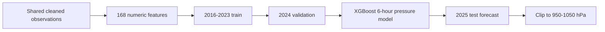

# Pressure Specialist

## 1. Overview & Final Metrics

The pressure model forecasts station pressure six hours ahead
(`HORIZON=12` at 30-minute cadence) using the shared multi-parameter feature
frame.

| Metric | Target | Current result |
|---|---:|---:|
| \(R^2\) | \(\ge 0.90\) | **0.9629** |
| RMSE | Lower is better | **0.7691 hPa** |
| MAE | Lower is better | **0.5687 hPa** |

> **Warning: stale metrics artifact.** `artifacts/eval_metrics.json` belongs to
> the archived monolith. Its pressure result is close (`0.9634`) but is not
> generated by the current modular checkpoint. The dashboard and current run
> are authoritative here.

## 2. The Problem Space

CSMI pressure is a macro-scale field, typically much smoother and more
predictable than visibility or wind. The signal combines:

- seasonal dry/monsoon regimes;
- synoptic highs and monsoon troughs;
- a semi-diurnal atmospheric tide with two daily peaks and troughs;
- local convective disturbances and occasional sharp pressure jumps.

The central modeling problem is separating repeatable tidal structure from a
genuine synoptic tendency.

## 3. Difficulties Faced

### Tide Versus Synoptic Change

A repeating 12-hour pressure oscillation can resemble a system passage in a
short window. Time-of-day encodings and multiple lag scales are needed to
identify whether a change is phase-consistent or anomalous.

### Real Drops Versus Sensor Errors

The cleaning layer nulls single-step pressure jumps above 10 hPa. This protects
training from obvious corruption, but genuine rapid trough passages still
need to survive and be modeled.

### Smoothing Extreme Excursions

The dashboard contains a short observed plunge near 989 hPa that the model
substantially smooths. Squared-error trees optimize the dominant smooth regime,
so isolated extremes remain the principal residual risk.

### Broad Shared Feature Surface

`mod_pressure.py` delegates to `model_common.prepare_target`; the checkpoint
currently consumes 168 numeric features. This gives strong context but makes
feature governance more important than in the target-specific modules.

## 4. Failed Approaches - The Graveyard

| Approach | Why it failed or was rejected | Lesson |
|---|---|---|
| Treating all sharp drops as outliers | Can erase real monsoon trough passages | Cleaning thresholds must respect meteorology |
| Very local pressure-only context | Cannot distinguish tide phase from synoptic drift | Include season, time, and cross-variable context |
| Excessive smoothing | Misses rare deep troughs | Stable variables still require tail monitoring |
| Target-specific rewrite | Unnecessary complexity for the most predictable target | Shared regression is adequate when physics is smooth |

No pressure-specific experimental objectives remain in the current source.

## 5. Concepts Implemented

### Future Target Construction

\[
y_t = P_{t+12}
\]

With 30-minute data, the shared model forecasts six hours ahead. Raw current
pressure and historical pressure features are valid predictors of the future
target.

### Synoptic Lags and Rolling State

For lags \(k\in\{1,2,3,6,12\}\):

\[
P^{(k)}_t = P_{t-k}
\]

Rolling means use windows 3 and 6; rolling standard deviations use windows
3, 6, and 12. These capture short tidal phase, local variability, and broader
system movement.

### Pressure Tendency

\[
\Delta P_{3h}=P_t-P_{t-6}
\]

The sign separates rising and falling regimes; magnitude indicates frontal or
trough strength.

## 6. Feature Engineering Reference

The active pressure checkpoint has 168 features. The exact inventory is
generated by `data_pipeline.add_features` and selected by
`model_common.get_feature_columns`.

| Feature family | Exact members / formula | Meteorological purpose |
|---|---|---|
| Current station state | `wind_dir`, `wind_speed`, `wind_gust`, `visibility`, `temp`, `dew_point`, `humidity`, `pressure`, weather flags, `cloud_cover` | Present synoptic and boundary-layer state |
| Cyclic time | `hour_sin/cos`, `month_sin/cos` | Semi-diurnal tide and season |
| Pressure tendency | `pressure_change`, `pressure_tendency_3h`, `pressure_tendency_sign`, `pressure_change_3h`, `pressure_drop_fast` | Direction and magnitude of pressure evolution |
| Pressure lags | `pressure_lag_1/2/3/6/12` | 0.5-6 hour memory |
| Pressure rolling means | `pressure_rolling_mean_3/6` | Smooth tidal/synoptic baseline |
| Pressure rolling std | `pressure_rolling_std_3/6/12` | Regime instability |
| Cross-variable interactions | `pressure_humidity`, `temp_humidity`, `humidity_temperature`, `humidity_wind` | Air-mass characterization |
| Thermodynamics | `temp_dew_diff`, `dew_point_depression`, `wet_bulb`, `dew_gap`, `dew_proximity`, `near_dew_flag` | Moisture and stability context |
| Lag families | For `temp`, `wind_speed`, `wind_gust`, `visibility`, `humidity`, wind-direction sin/cos, `temp_dew_diff`, `pressure_change`, `wind_speed_change`: lags 1/2/3/6/12 | Causal multi-field memory |
| Rolling families | Means 3/6 and standard deviations 3/6/12 for each stable variable | Multi-scale state and volatility |
| Visibility dynamics | `visibility_trend`, `visibility_acceleration`, `vis_drop_1/3`, `vis_drop_rate`, `low_visibility_flag/streak`, `vis_regime` | Weather-regime context |
| Moisture events | `high_humidity_flag`, `humidity_spike`, `morning_humidity` | Convective/monsoon moisture |
| Wind-visibility coupling | `wind_speed_x_visibility_lag_1/3/6`, `low_wind_flag` | Stagnation and advection |
| Weather indicators | `is_rain`, `is_fog`, `is_haze` and encoded METAR flags when present | System classification |

The model receives every numeric member of these families whose standard
deviation is at least \(10^{-6}\) and missing fraction is at most 30%.

## 7. Hyperparameter Reference

| Parameter | Value | Reasoning |
|---|---:|---|
| Objective | `reg:squarederror` | Appropriate for smooth continuous pressure |
| `n_estimators` | 1500 | Sufficient capacity with early stopping |
| `learning_rate` | 0.03 | Moderate convergence speed |
| `max_depth` | 6 | Nonlinear interactions without excessive depth |
| `subsample` | 0.8 | Row regularization |
| `colsample_bytree` | 0.8 | Feature regularization across 168 inputs |
| `early_stopping_rounds` | 50 | Validation-controlled training |
| `gamma` | 0.0 | No extra split threshold |
| `reg_alpha` | 0.0 | No L1 shrinkage |
| `reg_lambda` | 1.0 | Standard L2 smoothing |
| `tree_method` | `hist` | Efficient histogram training |
| `device` | `cuda` | GPU acceleration |
| `random_state` | 42 | Reproducibility |
| Train/validation/test | 2016-2023 / 2024 / 2025 | Strict temporal evaluation |

## 8. Final Metrics

| Metric | Value | Source |
|---|---:|---|
| \(R^2\) | **0.9629** | Dashboard title |
| RMSE | **0.7691 hPa** | Current modular run |
| MAE | **0.5687 hPa** | Current modular run |

## 9. Operational Interpretation

Sub-hPa MAE is useful for detecting sustained pressure tendency, monsoon trough
approach, and convective regime change. The model should not be interpreted as
a substitute for calibrated altimeter setting or official QNH. Its operational
value is trend awareness; isolated extreme pressure plunges remain a monitored
failure mode.
