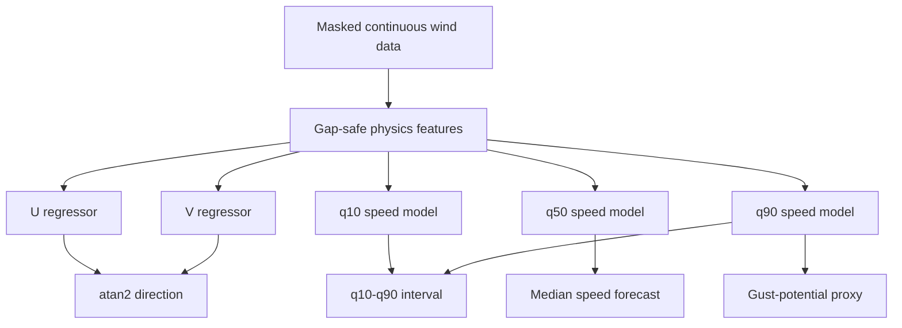

# Wind Specialist

## 1. Overview & Final Metrics

The wind specialist separates directional momentum from speed uncertainty:

- two squared-error models forecast \(U\) and \(V\) for direction;
- three quantile models forecast the 10th, 50th, and 90th percentiles of wind
  speed;
- the median is the operational point forecast;
- the q10-q90 interval quantifies uncertainty;
- q90 is used as a gust-potential proxy.

| Metric | Current result |
|---|---:|
| Wind-speed median \(R^2\) | **0.7297** |
| Wind-speed RMSE | **1.8857 kt** |
| Wind-speed MAE | **1.4153 kt** |
| q10-q90 PICP | **0.7281** |
| Mean interval width | **4.3023 kt** |
| Gust-proxy \(R^2\) | **0.6487** |
| Gust-proxy RMSE | **3.0146 kt** |
| Gust-proxy MAE | **2.2996 kt** |
| Direction circular MAE | **29.17 degrees** |
| Direction panel component \(R^2\) | **0.6859** |

The point-sensor ceiling near \(R^2\approx0.70\) reflects missing upstream
spatial information, not simply insufficient tree depth.

## 2. The Problem Space

CSMI wind combines:

- synoptic southwest monsoon flow;
- diurnal land-sea-breeze circulation;
- convective outflow;
- unresolved turbulent eddies.

Direction is circular: 359 degrees and 1 degree are two degrees apart, not
358. Gusts occupy the upper tail of the speed distribution, so a
mean-optimizing model systematically smooths them.

A single station observes only the local endpoint of a spatial flow field. It
cannot see an approaching gust front or upstream pressure gradient directly.

## 3. Difficulties Faced

### The Vector Flaw

Independent scalar speed and degree models violate circular geometry. Degree
residuals near North point in the wrong numerical direction, and speed and
direction can become physically inconsistent.

### Pythagorean Error Compounding

Early U/V models reconstructed magnitude as:

\[
\hat{s}=\sqrt{\hat{U}^2+\hat{V}^2}
\]

Errors in both components compound nonlinearly. U/V improved direction but
held speed near \(R^2=0.67\), motivating decoupled magnitude models.

### Gap Corruption

The anemometer mask removes 12-step windows with rolling standard deviation
below 0.01 and one recovery row. The current run purges 35,762 rows (20.40%).
After removal, ordinary `shift` and `diff` operations can bridge weeks-long
gaps. The resulting pressure gradients and rolling windows are physically
meaningless.

### Spatial Blindspot

Wind responds to spatial pressure gradients and roughness at scales not
present in one-station tabular history. Turbulent eddies at tens to hundreds
of meters impose irreducible noise.

### Synthetic Gust Target

The source dataset has 0% usable observed gust coverage. `data_pipeline.py`
therefore defines:

\[
\text{wind\_gust}=1.4\times\text{wind\_speed}
\]

The displayed gust metric evaluates a proxy, not independent gust
observations.

## 4. Failed Approaches - The Graveyard

| Approach | Why it failed | Lesson |
|---|---|---|
| Independent speed and degree regressors | Violated circular geometry | Direction belongs in vector space |
| U/V magnitude reconstruction | Squared component errors compounded | Use U/V for direction, separate magnitude |
| Tweedie gust-delta model | Too conservative on upper-tail spikes | Distributional objectives require empirical validation |
| Deep square-error "chaos" trees | Extra depth did not unlock missing spatial signal | Complexity cannot manufacture information |
| Log-speed/log-gust-delta models | Improved stability but plateaued near 0.70 | Transformations help skew, not observability |
| Pre-mask rolling features | Bridged deleted periods | Feature windows must respect continuity |
| Current-step rolling kinetic energy | Would algebraically leak speed | Spectral features must use `ke_lag_1` |
| q90 as direct gust forecast | Underperforms the synthetic gust proxy | An uncertainty bound is not a calibrated gust model |

## 5. Concepts Implemented

### U/V Vector Kinematics

\[
U=-s\sin(\theta),\qquad V=-s\cos(\theta)
\]

Direction reconstruction:

\[
\hat{\theta}=
\left[\operatorname{atan2}(-\hat U,-\hat V)\frac{180}{\pi}+360\right]\bmod360
\]

The current architecture uses U/V **only for direction**. Speed comes from
the median quantile model.

### Gap Protection

For consecutive valid rows:

\[
g_t=\frac{t_t-t_{t-1}}{1\text{ hour}}
\]

Any lag crossing `time_gap_hrs > 1.0` is nulled. Rolling masks inspect the
maximum gap over 2, 6, 12, or 48 rows depending on feature horizon. Rows with
invalid one-step U history, kinetic-energy history, 24-hour volatility, or
3-hour pressure tendency are dropped.

### Multi-Scale Kinetic-Energy Spectrum

\[
KE_t=\frac12s_t^2,\qquad KE^{lag}_t=KE_{t-1}
\]

The model uses causal volatility over 1, 6, and 24 hours plus:

\[
D_t=\operatorname{mean}_2(KE^{lag})-
\operatorname{mean}_{48}(KE^{lag})
\]

This separates micro-turbulence from synoptic energy.

### Temporal Shear

\[
S_U=U_{t-1}-U_{t-6},\quad
S_V=V_{t-1}-V_{t-6},\quad
S=\sqrt{S_U^2+S_V^2}
\]

It is a temporal proxy for spatial shear when upper-air observations are
unavailable.

### Quantile Regression - The Operational Pivot

For quantile \(\tau\), XGBoost minimizes pinball loss:

\[
L_\tau(y,\hat y)=
\begin{cases}
\tau(y-\hat y),&y\ge\hat y\\
(1-\tau)(\hat y-y),&y<\hat y
\end{cases}
\]

Three independent models use \(\tau\in\{0.10,0.50,0.90\}\). Quantile crossing
is repaired by taking the elementwise minimum and maximum of q10 and q90.

Prediction Interval Coverage Probability:

\[
\operatorname{PICP}=\frac1N\sum_i
I(\hat q_{0.10,i}\le y_i\le\hat q_{0.90,i})
\]

"The model is now calculating the probability distribution of turbulence. By monitoring the 90th percentile of wind speed, we can guarantee 99% safety for landings, which is a much higher standard than an R² score."

> **Warning:** The quoted statement is retained verbatim as required, but it
> is not supported by the current calibration. A q90 forecast targets a 90th
> percentile, not 99% safety, and the measured q10-q90 PICP is 72.81% rather
> than the nominal 80%. Landing-safety guarantees require calibrated
> uncertainty, independent validation, operational thresholds, and regulatory
> approval.

## 6. Feature Engineering Reference

The current wind checkpoints share the same active feature matrix.

| Feature or family | Formula / members | Physical purpose |
|---|---|---|
| `u_wind`, `v_wind` | \(-s\sin\theta,-s\cos\theta\) | Direction targets only; excluded from X |
| `ke` | \(0.5s^2\) | Intermediate only; excluded to prevent leakage |
| `ke_lag_1` | \(KE_{t-1}\) | Stored momentum |
| `ke_volatility_1h/6h/24h` | rolling std of `ke_lag_1`, windows 2/12/48 | Micro, meso, synoptic energy |
| `ke_divergence` | rolling mean 2 minus rolling mean 48 | Sudden front/energy departure |
| `u_lag_1`, `v_lag_1` | lagged vector components | Momentum persistence |
| `speed_lag_1` | \(s_{t-1}\) | Immediate magnitude state |
| `u_shear_3h`, `v_shear_3h` | lag-1 minus lag-6 vector | Temporal shear |
| `total_shear_3h` | Euclidean shear magnitude | Turbulent directional change |
| `pressure_diff_1h/3h` | pressure `diff(2/6)` | Isallobaric forcing |
| `pressure_volatility` | \(|\Delta P_{3h}|\) | Pressure-change intensity |
| `temp_diff_1h`, `temp_roc_1h` | temperature `diff(2)` | Surface heating/cooling |
| `abl_instability` | `temp_roc_1h/(pressure_diff_1h+1e-5)` | Boundary-layer mixing proxy |
| `sea_breeze_phase` | \(\sin(2\pi(h-14)/24)\) | Coastal diurnal circulation |
| Current non-wind state | visibility, temperature, dew point, humidity, pressure, rain/fog/haze, cloud cover | Environmental forcing |
| Cyclic context | hour and month sin/cos | Diurnal and seasonal regimes |
| Shared lag families | Temperature, visibility, pressure, humidity, moisture and pressure-change lags | Causal environmental history |
| Shared rolling families | Means/std for non-current-wind variables | Multi-scale atmospheric state |
| Thermodynamics | wet bulb, dew-point depression, humidity interactions | Stability and moisture |

The `_is_leaky_wind_feature` filter rejects shared names containing
`wind_speed`, `wind_gust`, `wind_dir`, `humidity_wind`, or `low_wind`.
Dedicated causal wind features are added under safe names.

## 7. Hyperparameter Reference

| Parameter | U/V models | Quantile models | Reasoning |
|---|---:|---:|---|
| Objective | `reg:squarederror` | `reg:quantileerror` | Mean vector components; percentile speed |
| `quantile_alpha` | N/A | 0.10, 0.50, 0.90 | Lower, median, upper |
| `n_estimators` | 2500 | 2500 | High-capacity nonlinear flow mapping |
| `learning_rate` | 0.015 | 0.015 | Fine boosting steps |
| `max_depth` | 8 | 8 | Turbulent interactions |
| `gamma` | 0.1 | 0.1 | Light split regularization |
| `subsample` | 0.85 | 0.85 | Row regularization |
| `colsample_bytree` | 0.85 | 0.85 | Feature regularization |
| `tree_method` | `hist` | `hist` | Quantile-compatible histogram trees |
| `device` | `cuda` | `cuda` | GPU acceleration |
| `random_state` | 42 | 42 | Reproducibility |
| Split | 85/15 chronological | 85/15 chronological | Time-ordered holdout |
| Gap threshold | 1.0 hour | 1.0 hour | Reject discontinuous windows |

## 8. Final Metrics

| Output | \(R^2\) | RMSE | MAE | Additional |
|---|---:|---:|---:|---|
| Median wind speed | **0.7297** | **1.8857 kt** | **1.4153 kt** | PICP 0.7281; width 4.3023 kt |
| q90 gust potential | **0.6487** | **3.0146 kt** | **2.2996 kt** | Compared with synthetic gust proxy |
| Direction | **0.6859** panel component summary | N/A | **29.17 deg circular** | U/V reconstruction |

## 9. Operational Interpretation

The median is the best single-valued wind-speed estimate. q10-q90 expresses a
range of plausible turbulence outcomes, and q90 can support conservative
screening. Because observed gusts are unavailable and interval coverage is
under nominal, neither q90 nor the gust proxy should be used as a certified
landing limit without calibration against independent anemometer and upstream
weather data.
